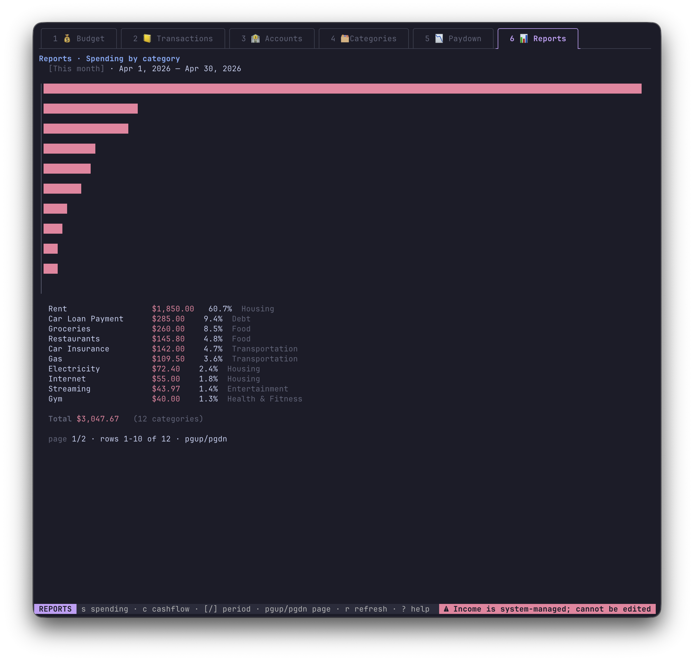
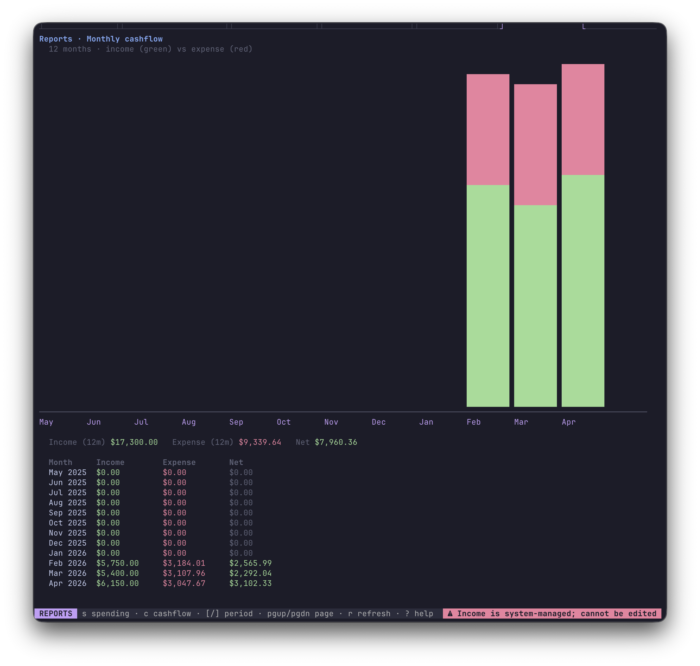

<div align="center">

# budget

**A fast, keyboard-driven personal finance app for your terminal.**

Track accounts, assign money to categories each month, project debt paydown, and see where your money goes — all in a local SQLite file with no accounts, no sync, and no subscription.


</div>

---

## Features

- **Envelope budgeting** — assign money to categories each month; available balance carries forward (positive only)
- **Multi-account** — checking, savings, cash, credit cards, and loans in one view
- **Transfers** — move money between accounts; tag the from-leg with a budget category (e.g. paying a credit card)
- **Debt paydown projector** — real APR daily-compound amortization; links to your budget so actual payments replace forecasts automatically
- **Reports** — spending by category (horizontal bar chart) and 12-month cashflow (income vs. expense)
- **Sinking-fund goals** — set a target amount + due date; the app tells you the monthly contribution needed
- **Income tracking** — estimate income for each month; see estimated vs. actual side-by-side on the Budget tab
- **Fully local** — one SQLite file, no network access, no accounts, no telemetry

---

## Screenshots

**Budget** — assign money to categories each month, track against income, see sinking-fund goals


**Income panel** — estimate income per source; see estimated vs. actual side-by-side

| Income panel | Edit income | Assign amount |
|---|---|---|
|  |  |  |

---

**Transactions** — every account in one list; filter by account or month

| All accounts | Filtered to Chase Sapphire |
|---|---|
|  |  |

Transaction form with calendar date picker and account/category pickers:

| Edit transaction | New transaction | Date picker |
|---|---|---|
|  |  |  |

| Account picker | Category picker | Account filter |
|---|---|---|
|  |  |  |

---

**Accounts** — net worth at a glance; credit and loan balances with APR

| Account list | Edit account |
|---|---|
|  |  |

---

**Categories** — grouped categories with optional sinking-fund goals

| Category list | Edit category (goal) | Edit category (sinking fund) |
|---|---|---|
|  |  |  |

---

**Paydown** — daily-compound debt amortization linked to your budget categories


---

**Reports** — spending by category and 12-month cashflow chart

| Spending by category | Monthly cashflow |
|---|---|
|  |  |

---

## Quick start

**Requirements:** [Go 1.21+](https://go.dev/dl/)

```bash
git clone https://github.com/sbengtson/budget
cd budget
make setup    # download deps + install goose
make seed     # load 3 months of realistic demo data
make run      # launch the app
```

To start fresh with your own data:

```bash
make db-reset  # wipe the database
make run       # auto-migrates on first open
```

---

## Usage

```bash
make run                           # open ./data/budget.db
go run ./cmd/budget --db ~/my.db   # custom database path
```

The database is created and all migrations are applied automatically on first run.

---

## Development

```bash
make setup      # install Go module deps + goose CLI
make build      # compile binary to ./bin/budget
make test       # run the full test suite
make seed       # load demo data into ./data/budget.db
make clean      # remove the compiled binary
```

Database commands:

```bash
make db-path    # print the configured database path
make db-migrate # run pending migrations (goose up)
make db-reset   # delete the database and re-run migrations
make db-status  # show goose migration status
make db-delete  # delete the database file (and WAL/SHM)
```

---

## Keymap

**Global**

| Key | Action |
|---|---|
| `1`–`6` / click | switch tabs |
| `shift+h` / `shift+l` | prev / next tab |
| `q` / `ctrl+c` | quit |
| `?` | show / hide help |
| `esc` | cancel form or modal |

**List views** (Accounts, Categories, Transactions)

| Key | Action |
|---|---|
| `↑` `↓` / `j` `k` | move cursor |
| `n` | new |
| `enter` | edit selected |
| `d` | archive / delete (with confirm) |

**Transactions**

| Key | Action |
|---|---|
| `c` | toggle cleared on selected |
| `f` / `F` | filter by account / clear filter |
| `<` / `>` | prev / next month filter |
| `t` / `M` | jump to current month / clear month filter |
| `pgup` / `pgdn` | page through long lists |

**Budget tab**

| Key | Action |
|---|---|
| `↑` `↓` | move cursor |
| `enter` | edit assigned amount for selected category |
| `g` | set goal + due date |
| `i` | open income panel for the month |
| `<` / `>` | prev / next month |
| `t` | jump to current month |

Income panel: `n` new · `enter` edit · `d` delete · `esc` back.
Multiple income lines per month (e.g. Salary, Freelance). The Budget banner shows `Estimated · Actual · Budgeted · Remain · Est−Act`.

**Paydown tab**

| Key | Action |
|---|---|
| `↑` `↓` | select account |
| `a` | add account to plan (must have APR set) |
| `e` | edit monthly payment for selected account |
| `c` | link a budget category to selected account |
| `r` / `d` | remove selected account from plan |
| `+` / `-` | extend / shrink projection by 12 months |
| `,` / `.` | page through projection rows |

Each included account projects monthly amortization at `APR / 365` daily compounding. If a payment is below the first month's interest the row flags `payment ≤ interest, debt grows`.

**Variable payments:** for every projected month the engine picks the payment in this order:
1. **spent** — actual outflow against the linked category that month
2. **assigned** — the budgeted amount for that month
3. **default** — the account's fixed monthly payment fallback

The `Source` column labels each row (`✓ spent`, `→ assigned`, `· default`).

**Reports tab**

| Key | Action |
|---|---|
| `s` | spending by category |
| `c` | monthly cashflow (12 months) |
| `[` / `]` | prev / next period (this month / 30d / 90d / YTD) |
| `pgup` / `pgdn` | page through spending categories |
| `r` | refresh |

**Forms**

`tab` / `↑↓` moves between fields; `enter` advances or saves on the last field; `space` opens a picker on Type / Account / Category fields. On the **Date** field in the transaction form, `space` opens a calendar picker — `hjkl` / arrows navigate days, `tab` cycles month → year → day focus, `enter` commits, `esc` cancels.

---

## Concepts

**Accounts** — `checking`, `savings`, `cash`, `credit`, `loan`. Credit and loan accounts carry a negative running balance when in debt; purchases are outflows and payments are inflows (via transfer). Net worth = assets + liabilities.

**Categories** are grouped and can carry a sinking-fund goal (`goal amount` + `due date`). The Budget tab shows how much to contribute each month to reach the goal on time.

**Envelope budgeting** — each month you assign money to categories. Available = `carryover (≥ 0 from prior month) + assigned − spent`. Unspent money rolls forward; overspending does not.

**Transfers** — moving money between accounts records two linked transactions. A category can be attached to the from-leg (e.g. "CC Payment") so the spending shows in your budget without double-counting the inflow.

**Liability starting balance** — enter the amount owed as a positive number (e.g. `2500` for a $2,500 credit card balance). The form automatically stores it as negative so ledger math stays consistent.

**Income category** — a system-managed `Income` category is seeded automatically on first run. Categorize paycheck inflows here. The Budget tab shows `Estimated` (manual forecasts entered via `i`) vs. `Actual` (real inflows categorised as Income).

**Amounts** — stored as integer cents. The input parser accepts `1234.56`, `$1,234.56`, `1234`, `-50`, `.5`, etc.

---

## Layout

```
cmd/budget/main.go          entrypoint, flag parsing
cmd/seed/main.go            demo data seeder
internal/db/                SQLite open + embedded goose migrations
internal/money/             cents ↔ human string parsing and formatting
internal/store/             persistence layer (one file per aggregate)
internal/paydown/           debt amortization projection (pure Go, no DB)
internal/tui/               Bubble Tea screens and components
```
